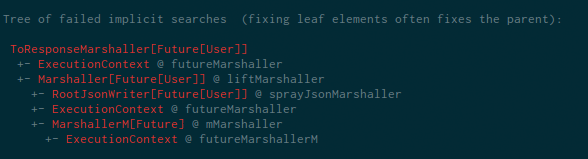

# Rescue

Drowning in implicit resolution problems? Here's your lifeline macro getting you back
into control of your implicits.

## The situation

### The code

You try to use spray-routing or any other Scala library which makes use of implicits:

```scala
case class User(name: String)
object User {
  import DefaultJsonProtocol._
  implicit val xyz = jsonFormat1(User.apply)
}

def retrieveUser(): Future[User]

import spray.httpx.SprayJsonSupport._
import spray.routing.Directives._

path("users")(
  complete(retrieveUser())
)
```

### The error message

You get an error message like this from the compiler:

```
could not find implicit value for parameter marshaller: ToResponseMarshaller[Future[User]]
```

but you don't know why. Often the reason for a missing implicit isn't obvious because
some underlying implicit search failed but none of those underlying failures is reported.

You try `-Xlog-implicits` which helps but the output is not easily comprehensible.

### The solution

Add this dependency to your project:

```scala
libraryDependencies += "net.virtual-void" %% "rescue" % "1" % "provided"
```

Add this import to a file with implicit errors

```scala
import net.virtualvoid.rescue.HelpMe.withMyImplicits
```

In addition to the original error message, get this output:



You are baffled because these are still lots of errors and possible vectors for fixing the issue.
You first look at the leaf nodes and figure since you are using Futures that you should probably
provide an implicit `ExecutionContext`. Et voilà your code compiles.

## FAQ

#### Can you explain the tree display?

Yes. Here's the error tree again with more explanations inline:

```
ToResponseMarshaller[Future[User]]              <- the missing implicit at the root (also mentioned in the error message)
   +- ExecutionContext @ futureMarshaller       <- `@ futureMarshaller` means this implicit was missing when trying to use the value `futureMarshaller` as an implicit of the parent type
   +- Marshaller[Future[User]] @ liftMarshaller
     +- RootJsonWriter[Future[User]] @ sprayJsonMarshaller <- other possible (but unlikely) implicit values that would solve this implicit resolution
     +- ExecutionContext @ futureMarshaller
     +- MarshallerM[Future] @ mMarshaller
       +- ExecutionContext @ futureMarshallerM
       
TestImplicit.scala: could not find implicit value for parameter marshaller: spray.httpx.marshalling.ToResponseMarshaller[scala.concurrent.Future[TestImplicit.this.User]]
     complete(retrieveUser())
                          ^
```

#### How does it work?

One word: macros.

#### One word is not an answer. So, how does it work exactly ?

Well, I hoped to get away with just saying "macros" which sounds like a proper solution - even more if packaged
into a library.

Alas, the "solution" is really a hack. Here's a non-exhaustive list of methods used to collect the information:
  * use a macro that never returns as a simple door into the compiler 
  * use reflection to access and modify compiler internals not presented in the macro API
  * fetch error information by intercepting error reporting methods
  * "parse" error message with regular expressions
  * reverse engineer `@implicitNotFound` messages with regular expressions to get back at the original types
  * parse and shorten identifiers with regular expressions
  * build a tree of errors by matching the string representation of types in error messages

#### Why isn't the Scala compiler providing this kind of information?

I don't know. I guess many of those hacks I had to do are caused by missing infrastructure in the compiler.
With this infrastructure missing, maybe it was hard imagining a solution. So, maybe this can be a prototype
for better implicit error reporting in the compiler itself.

Improving infrastructure could mean:
 * providing vital information for solving an implicit resolution problem only behind a flag which prints information
   regardless of whether I'm currently interested or not (why report anything if implicit resolution was successful?)
 * provide a better model for resolving implicits in general, currently it seems the compiler tries an implicit by putting it into the target position and then re-types the code in question which in turn may trigger subsequent implicit resolutions, the information about what goes wrong inside is only transported as the side-effect of reporting the error when `-Xlog-implicits` is turned on
 * when reporting errors don't turn identifiers or types into strings
 * don't even report particular error _messages_ as strings, if an error _message_ had an identity itself you could
   provide more information for it on the web
 * `@implicitNotFound` is nice but can mask details of implicit resolution errors
 

#### This is not a solution but merely a better presentation of information. Fixing implicits is still hard. Couldn't you do better?

Probably, here's a list of possible future improvements

 * provide a database with known implicits and solutions how to provide them
 * using the database provide a heuristic that guides you which implicit value you should look for first
 * provide information with a modern kind of UI which supports higher information density than text in a console window
 * try known implicit providers to fix gaps that cannot be found using the current approach (e.g. when the import to `SprayJsonSupport` is missing)
 * include successful parts of implicit resolution into the tree
