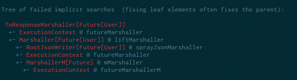

# Rescue

Drowning in implicit resolution problems? Here's your lifeline macro getting you back
into control of your implicits.

## The situation

### The code

You try to use spray-routing or any other Scala library which makes use of implicits:

```scala
case class User(name: String)
object User {
  import DefaultJsonProtocol._
  implicit val xyz = jsonFormat1(User.apply)
}

def retrieveUser(): Future[User]

import spray.httpx.SprayJsonSupport._
import spray.routing.Directives._

path("users")(
  complete(retrieveUser())
)
```

### The error message

You get an error message like this from the compiler:

```
could not find implicit value for parameter marshaller: ToResponseMarshaller[Future[User]]
```

but you don't know why. Often the reason for a missing implicit isn't obvious because
some underlying implicit search failed but none of those underlying failures is reported.

You try `-Xlog-implicits` which helps but the output is not easily comprehensible.

### The solution

Add this dependency to your project:

```scala
libraryDependencies += "net.virtual-void" %% "rescue" % "1" % "provided"
```

Add this import to a file with implicit errors

```scala
import net.virtualvoid.rescue.HelpMe.withMyImplicits
```

In addition to the original error message, get this output:



You are baffled because these are still lots of errors and possible vectors for fixing the issue.
You first look at the leaf nodes and figure since you are using Futures that you should probably
provide an implicit `ExecutionContext`. Et voilà your code compiles.

## FAQ

#### How does it work?

## Future improvements

 * provide a database with known implicits and solutions how to provide them
